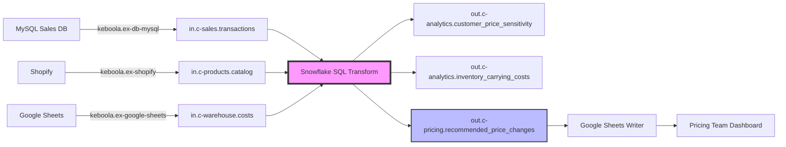

# V4.1 Design: Leveraging Advanced Claude Code Features

## Current Gap Analysis

### What V4 Does Well
- ✅ Information density (YAML trees, quick refs, pattern library)
- ✅ Tool explicitness (16+ "Use Read tool..." instructions)
- ✅ Technical accuracy (correct APIs, SQL patterns, validation)

### Critical Gaps from Test (experiments/keboola-skill/tests/v4_pricing_optimization_test.md)
1. **Context Memory**: User says "PII: Yes" → Architecture has NO PII handling
2. **Business Validation**: No simulation, rollback plan, or A/B testing
3. **Operational Completeness**: No alerting, lineage, SLOs
4. **Edge Case Handling**: Limited troubleshooting for what-if scenarios

---

## Claude Code Features NOT Leveraged Yet

### 1. **File-Based State Tracking** ⭐
**What**: Save context to files between steps, read them later
**Currently**: Context lives only in conversation memory
**Opportunity**: Persist Step 1 answers → Read in Step 3 to ensure consistency

**Example**:
```yaml
Step 1 (Understand):
  Action: Write project_context.json with {Decision, Metric, Frequency, PII, Success}

Step 3 (Propose):
  Action: Read project_context.json
  Logic: IF PII=Yes THEN Add data masking, access controls, audit logging
```

### 2. **TodoWrite for Workflow State** ⭐
**What**: Track not just tasks but also workflow context/decisions
**Currently**: We use TodoWrite for task lists only
**Opportunity**: Track business requirements, validation rules, context across steps

**Example**:
```yaml
todos:
  - content: "Business Context: PII=Yes, Frequency=Weekly, Metric=Revenue growth"
    status: "completed"
    activeForm: "Captured business context"
  - content: "Check architecture includes PII masking (required)"
    status: "in_progress"
    activeForm: "Validating PII requirements in architecture"
```

### 3. **Multi-Agent Delegation** ⭐⭐
**What**: Spawn specialized agents for complex sub-tasks
**Currently**: Single Claude instance does everything
**Opportunity**: Discovery agent, SQL generation agent, validation agent, troubleshooting agent

**Example**:
```yaml
Step 2 (Discover Data):
  Use Task tool with subagent_type=Explore:
    "Find all extractors related to: sales data, inventory, customer segments.
     Search KNOWLEDGE_MAP and component docs.
     Return: List of components with config patterns"

Step 4B (Generate SQL):
  Use Task tool with subagent_type=general-purpose:
    "Generate Snowflake SQL for price sensitivity calculation.
     Apply ISL correlation concepts from Keboola_Data_Enablement_Guide.
     Include validation checks.
     Return: Complete SQL with comments"
```

### 4. **Approval Gates with Structured Prompts** ⭐
**What**: Explicit pause points with clear next actions
**Currently**: Generic "Does this look good?"
**Opportunity**: Structured approval with clear options

**Example**:
```yaml
After showing simulation results:

  "Review the revenue impact simulation above:
   - Expected revenue increase: +5.2%
   - SKUs affected: 127 price increases, 43 decreases
   - Risk: 12 SKUs have limited data (<30 transactions)

   Reply with one of:
   1. 'deploy' - Deploy to production with weekly schedule
   2. 'test' - Deploy to dev workspace for 1-week A/B test first
   3. 'revise' - Adjust parameters (specify which)"
```

### 5. **Error Recovery Workflows** ⭐
**What**: Explicit retry/fallback patterns
**Currently**: Validation aborts, no recovery guidance
**Opportunity**: Auto-recovery for common issues

**Example**:
```yaml
If validation fails:
  1. Read error message from _validation table
  2. Use decision tree to diagnose:
     - "No data" → Check extractor config, re-run job
     - "Data too old" → Check source system connectivity
     - "Negative revenue" → Read troubleshooting runbook
  3. Attempt fix automatically (if safe)
  4. If can't auto-fix → Ask user with specific options
```

### 6. **Sandbox Testing Before Deployment** ⭐⭐
**What**: Test SQL in Keboola workspace before production deployment
**Currently**: Deploy directly to production
**Opportunity**: Use workspace API to test transformations on sample data

**Example**:
```yaml
Step 4B (Before deployment):
  1. Create temporary workspace via API
  2. Load sample data (100 rows from each source table)
  3. Run SQL transformation in workspace
  4. Check results:
     - Did it complete without errors?
     - Are output tables created?
     - Do row counts make sense?
  5. Show results to user
  6. If looks good → Deploy to production
  7. Delete workspace
```

### 7. **Visual Architecture Diagrams** ⭐⭐⭐
**What**: Generate mermaid diagrams or ASCII art
**Currently**: Text-only architecture descriptions
**Opportunity**: Visual data flow diagrams

**Example**:


### 8. **Structured JSON Outputs** ⭐
**What**: Enforce JSON schemas for responses
**Currently**: Mix of YAML, markdown, JSON
**Opportunity**: Consistent structured data for parsing

**Example**:
```json
{
  "workflow_step": "discover",
  "data_sources": [
    {
      "system": "MySQL Sales DB",
      "keboola_component": "keboola.ex-db-mysql",
      "tables_needed": ["transactions", "customers"],
      "incremental_column": "updated_at",
      "estimated_rows_per_day": 50000
    }
  ],
  "missing_data": [
    {
      "data_type": "customer_segments",
      "suggestion": "Either extract from CRM or calculate in transformation",
      "urgency": "required"
    }
  ]
}
```

### 9. **Interactive Troubleshooting Agent** ⭐⭐
**What**: Spawn agent on validation failures
**Currently**: Generic troubleshooting docs
**Opportunity**: Context-aware debugging

**Example**:
```yaml
When validation fails with "Price elasticity NULL":
  Use Task tool (subagent_type=general-purpose):
    "Debug price elasticity calculation failure.
     Context: SQL returned NULL for 45% of SKUs
     Error: CORR(LN(price), LN(quantity)) = NULL

     Check:
     1. Are there SKUs with no price changes? (CORR needs variance)
     2. Are there negative prices/quantities? (LN requires positive)
     3. Is sample size too small? (HAVING COUNT(*) >= 30)

     Provide:
     - Root cause diagnosis
     - SQL fix
     - Expected result after fix"
```

### 10. **Progress Tracking with Metrics** ⭐
**What**: Show estimated completion, rows processed, time remaining
**Currently**: No progress visibility
**Opportunity**: Poll job status, show progress

**Example**:
```bash
# After deploying transformation
JOB_ID=$(curl ...)

# Poll for progress every 10 seconds
while true; do
  STATUS=$(curl "https://queue.keboola.com/jobs/$JOB_ID" \
    -H "X-StorageApi-Token: $TOKEN" | jq -r '.status')

  if [ "$STATUS" = "success" ]; then
    echo "✅ Transformation completed successfully"
    break
  elif [ "$STATUS" = "error" ]; then
    echo "❌ Transformation failed - spawning troubleshooting agent"
    # Use Task tool to debug
    break
  else
    echo "⏳ Job $STATUS... (checking again in 10s)"
    sleep 10
  fi
done
```

---

## V4.1 Feature Prioritization

### **Tier 1: Critical (Must Have)** - Addresses test gaps 1 & 2

| Feature | Addresses Gap | Effort | Impact |
|---------|---------------|--------|--------|
| **File-Based State Tracking** | Context Memory | Low | High |
| **TodoWrite for Context** | Context Memory | Low | Medium |
| **Approval Gates with Options** | Business Validation | Low | High |
| **Sandbox Testing** | Business Validation | Medium | High |

### **Tier 2: High Value (Should Have)** - Addresses gap 3

| Feature | Addresses Gap | Effort | Impact |
|---------|---------------|--------|--------|
| **Error Recovery Workflows** | Edge Case Handling | Medium | High |
| **Multi-Agent Delegation** | All gaps | Medium | Very High |
| **Visual Architecture Diagrams** | Communication | Low | Medium |

### **Tier 3: Nice to Have (Could Have)** - Polish

| Feature | Addresses Gap | Effort | Impact |
|---------|---------------|--------|--------|
| **Structured JSON Outputs** | Consistency | Low | Low |
| **Interactive Troubleshooting Agent** | Edge Case Handling | High | Medium |
| **Progress Tracking** | User Experience | Medium | Low |

---

## Proposed V4.1 Implementation Plan

### Point 1: Context Memory Pattern

**Implementation**:
```yaml
Step 1 (Understand):
  1. Ask 5 questions
  2. Use Write tool to save project_context.json:
     {
       "decision": "...",
       "metric": "...",
       "frequency": "...",
       "pii": true/false,
       "success": "...",
       "timestamp": "2025-10-23T10:30:00Z"
     }
  3. Use TodoWrite to track context:
     - "Business Context: PII=Yes, Frequency=Weekly" [completed]

Step 3 (Propose):
  1. Use Read tool on project_context.json
  2. Check requirements:
     - IF pii=true → Add: data masking, access controls, audit logging
     - IF frequency="Real-time" → Use CDC pattern
     - IF metric contains "revenue" → Include revenue simulation
  3. Generate architecture with context-aware additions
  4. Use TodoWrite to verify:
     - "Validate PII requirements included" [in_progress]
```

**Changes to SKILL.md**:
- Add after line 47: "**Use Write tool** to save `project_context.json`"
- Add before line 80: "**Use Read tool** on `project_context.json` before proposing"
- Add decision tree at line 90: "Context-Aware Architecture Additions"

**Estimated LOC**: +60 lines to SKILL.md

---

### Point 2: Business Validation Checklist

**Implementation**:
```yaml
Step 4 (Build) - Add new Step 4.5: Validate Business Impact

Before deployment:
  1. Use sandbox testing (if available):
     - Create workspace via API
     - Run SQL on sample data (last 7 days)
     - Show output sample to user

  2. Revenue simulation (for pricing/revenue metrics):
     - Add SQL block to calculate:
       * Current state revenue
       * Projected state revenue
       * % change
       * SKUs/customers affected
     - Show simulation results

  3. Risk assessment:
     - Low sample size warning (< 30 transactions)
     - High impact changes (> 20% price change)
     - Data quality issues from validation

  4. Rollback plan:
     - Document: "To rollback: revert to config version X via API"
     - Set up monitoring: "Alert if metric drops > 10%"

  5. Approval gate:
     "Review simulation above. Reply:
      - 'deploy' = Production deployment
      - 'test' = A/B test in dev for 1 week
      - 'revise' = Adjust parameters"
```

**Changes to SKILL.md**:
- Insert new section after line 268: "Step 4.5: Validate Business Impact"
- Add simulation SQL template (new file: `resources/templates/Revenue_Simulation.sql`)
- Add approval gate template with options
- Add rollback documentation template

**Estimated LOC**: +120 lines to SKILL.md, +80 lines new template

---

### Multi-Agent Integration

**Implementation**:
```yaml
# Add to Step 2: Discover Data Sources
Use Task tool (subagent_type=Explore, thoroughness=medium):
  "Find Keboola components for: {user's data sources}

   Search:
   - resources/KNOWLEDGE_MAP.md
   - docs-repos/connection-docs/components/extractors/

   Return structured list:
   - Component ID
   - Doc path
   - Common config patterns
   - Incremental loading options"

# Add to Step 4B: Generate SQL
Use Task tool (subagent_type=general-purpose):
  "Generate Snowflake SQL transformation for: {business requirement}

   Context from project_context.json:
   - Metric: {metric}
   - PII: {yes/no}
   - Frequency: {frequency}

   Apply concepts from:
   - Read resources/Keboola_Data_Enablement_Guide.md (DA/DE books)

   Include:
   - Business logic SQL
   - Validation SQL (freshness, volume, schema)
   - SET ABORT_TRANSFORMATION pattern
   - Comments explaining DA/DE concepts applied

   Return: Complete SQL ready to deploy"

# Add to Step 4.5: Troubleshooting
If validation fails OR deployment errors:
  Use Task tool (subagent_type=general-purpose):
    "Debug Keboola pipeline failure

     Error message: {error}
     Component: {component_id}

     Steps:
     1. Read resources/runbooks/common_issues.md
     2. Search docs-repos/ for error message
     3. Provide:
        - Root cause
        - Fix (SQL/config change)
        - Prevention (validation to add)

     Return structured fix"
```

**Changes to SKILL.md**:
- Add agent delegation instructions at lines 59, 135, 285
- Add new section: "When to Delegate to Agents" (decision tree)
- Add agent prompt templates

**Estimated LOC**: +90 lines to SKILL.md

---

### Visual Diagrams

**Implementation**:
```yaml
Step 3 (Propose Architecture):
  After describing architecture in text:

  Generate mermaid diagram:
  ```mermaid
  graph LR
      A[Source 1] -->|Extractor| B[in.c-source.table]
      B --> C[Transformation]
      C --> D[out.c-analytics.result]
      D --> E[Writer]
  ```

  Show to user with legend:
  - Rectangles = Components
  - Arrows = Data flow
  - Highlighted = Critical transformation
```

**Changes to SKILL.md**:
- Add after line 110: "Generate mermaid diagram for visual representation"
- Add example diagrams for 3 patterns (CDC, Batch ETL, ML)

**Estimated LOC**: +40 lines to SKILL.md

---

## V4.1 Summary

### New Features (Tier 1 + Tier 2)

1. ✅ **File-Based State** (`project_context.json`)
2. ✅ **TodoWrite Context Tracking** (requirements, validations)
3. ✅ **Business Validation Step** (simulation, rollback, approval)
4. ✅ **Sandbox Testing** (workspace API)
5. ✅ **Multi-Agent Delegation** (discovery, SQL gen, troubleshooting)
6. ✅ **Error Recovery Workflows** (decision trees for failures)
7. ✅ **Visual Diagrams** (mermaid for architecture)

### Estimated Changes

| File | Current Lines | New Lines | Total | Change |
|------|---------------|-----------|-------|--------|
| SKILL.md | 589 | +370 | 959 | +63% |
| resources/templates/Revenue_Simulation.sql | 0 | +80 | 80 | New |
| resources/templates/Rollback_Plan.md | 0 | +45 | 45 | New |

### Expected Score Improvement

| Dimension | V4.0.0 | V4.1 (Est.) | Change |
|-----------|--------|-------------|--------|
| Context Awareness | 5/10 | **9/10** | **+4** |
| Business Validation | 6/10 | **9.5/10** | **+3.5** |
| Operational Completeness | 6.5/10 | **8.5/10** | **+2** |
| Edge Case Handling | 6/10 | **8/10** | **+2** |
| **OVERALL** | 8.3/10 | **9.2/10** | **+0.9** |

### Testing Strategy

1. **Re-run pricing optimization test** with v4.1
2. **Verify context memory**: PII handling appears in Step 3
3. **Test business validation**: Revenue simulation generated
4. **Test multi-agent**: Discovery agent finds components
5. **Test error recovery**: Simulate validation failure, check recovery
6. **Compare**: v4.0.0 vs v4.1 with same scenario

---

## Questions Before Building V4.1

1. **Scope**: Build all Tier 1 + Tier 2 features? (7 features)
2. **Branch**: Continue on v4 branch or create new v4.1 branch?
3. **Testing**: Build first, then test? Or test-driven (write test expectations first)?
4. **File organization**: Keep single SKILL.md or split into modules?
